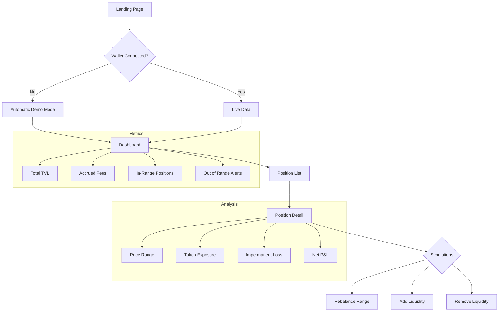
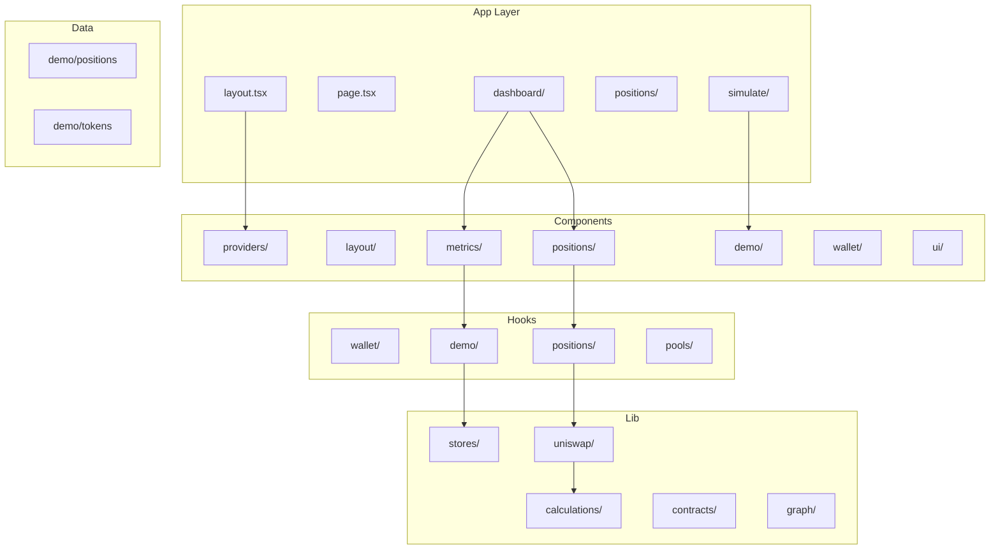
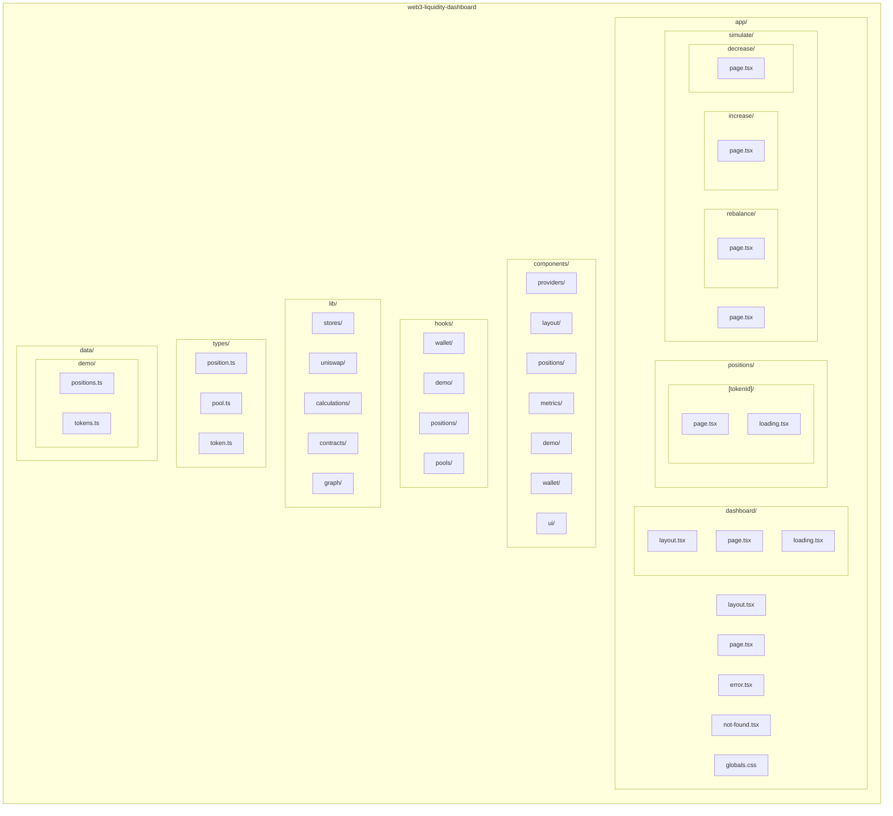

# Web3 Liquidity Dashboard


Professional liquidity management dashboard for **Uniswap V3**, designed for advanced LPs (Liquidity Providers). Provides detailed position analysis, real-time metrics, and strategy simulations.

## Key Features

- **Multi-Chain Support**: Ethereum Sepolia and Avalanche Fuji
- **Wallet Integration**: RainbowKit + Wagmi v2 with MetaMask, WalletConnect, and Coinbase support
- **Demo Mode**: Explore all features without connecting a wallet
- **Complete Dashboard**: TVL, accrued fees, range status
- **Position Details**: Price range visualization, token exposure, Impermanent Loss
- **Simulations**: Rebalancing, adding and removing liquidity without real transactions
- **Dark Mode First**: Professional DeFi-style design

---

## Tech Stack

| Category | Technology |
|----------|------------|
| Framework | Next.js 15.5.7+ (App Router) |
| Language | TypeScript (strict mode) |
| Styling | Tailwind CSS v4 |
| Web3 | Wagmi v2 + Viem + RainbowKit |
| State Management | Zustand (persist) |
| Data Fetching | TanStack Query v5 |
| Protocols | Uniswap V3 SDK |
| Networks | Ethereum Sepolia, Avalanche Fuji |

---

## Application Flow



---

## Project Architecture



---

## Folder Structure



---

## Installation

### Prerequisites

- Node.js 18.17+
- pnpm 8.0+

### Steps

```bash
git clone <repository-url>
cd web3-liquidity-dashboard

pnpm install

pnpm dev
```

The application will be available at `http://localhost:3000`

### Production Build

```bash
pnpm build
pnpm start
```

---

## Usage

### Demo Mode

Demo Mode activates automatically when no wallet is connected. You can also enable it manually from the dashboard.

**Demo Mode Features:**
- 5 sample positions with different pools
- Realistic TVL and fees data
- In-range and out-of-range positions
- Permanent state persistence with Zustand

### Connect Wallet

1. Click "Connect Wallet" in the header
2. Select your wallet (MetaMask, WalletConnect, Coinbase)
3. Approve the connection
4. Make sure you're on a supported network (Sepolia or Fuji)

### Dashboard

The dashboard displays:
- **Total TVL**: Total value of all your positions
- **Accrued Fees**: Unclaimed pending fees
- **Positions**: Total number of active positions
- **Out of Range**: Alerts for out-of-range positions

### Simulations

Simulations allow you to test strategies without making real transactions:

| Simulation | Description |
|------------|-------------|
| Rebalance | Adjust the price range of a position |
| Add Liquidity | Add more tokens to an existing position |
| Remove Liquidity | Withdraw liquidity partially or completely |

---

## Uniswap V3 Calculations

### Tick Math

```
price = 1.0001^tick
sqrtPriceX96 = sqrt(price) * 2^96
```

### Impermanent Loss

```
IL = 2 * sqrt(priceRatio) / (1 + priceRatio) - 1
```

### Position Health

A position is "in range" when:
```
tickLower <= currentTick < tickUpper
```

---

## Supported Contracts

### Ethereum Sepolia

| Contract | Address |
|----------|---------|
| NonfungiblePositionManager | `0x1238536071E1c677A632429e3655c799b22cDA52` |
| Factory | `0x0227628f3F023bb0B980b67D528571c95c6DaC1c` |
| SwapRouter02 | `0x3bFA4769FB09eefC5a80d6E87c3B9C650f7Ae48E` |
| QuoterV2 | `0xEd1f6473345F45b75F8179591dd5bA1888cf2FB3` |

---

## State Management

Demo Mode state is managed with **Zustand** and automatically persists to localStorage:

```typescript
interface DemoState {
  isDemoMode: boolean
  enableDemoMode: () => void
  disableDemoMode: () => void
  toggleDemoMode: () => void
}
```

---

## Roadmap

- [ ] Mainnet support
- [ ] Transaction history
- [ ] Out-of-range notifications
- [ ] Integration with more DEXs
- [ ] Performance charts
- [ ] Export data to CSV

---

## License

MIT License - See [LICENSE](LICENSE) for more details.

---

## Contributing

1. Fork the repository
2. Create a branch (`git checkout -b feature/new-feature`)
3. Commit your changes (`git commit -m 'Add new feature'`)
4. Push to the branch (`git push origin feature/new-feature`)
5. Open a Pull Request
