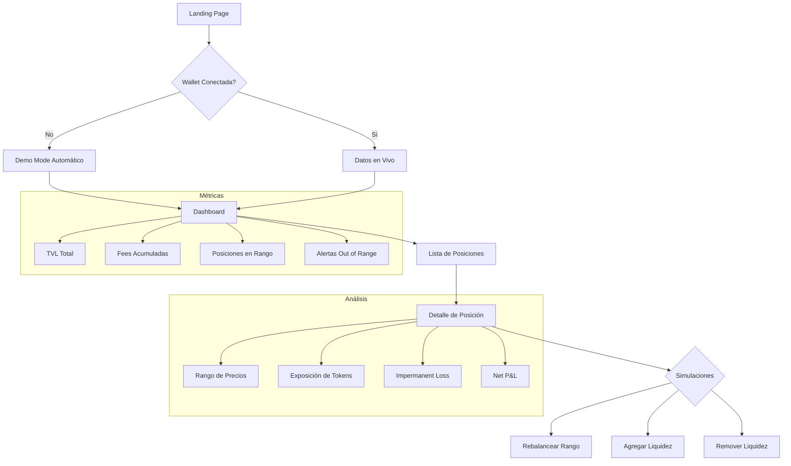
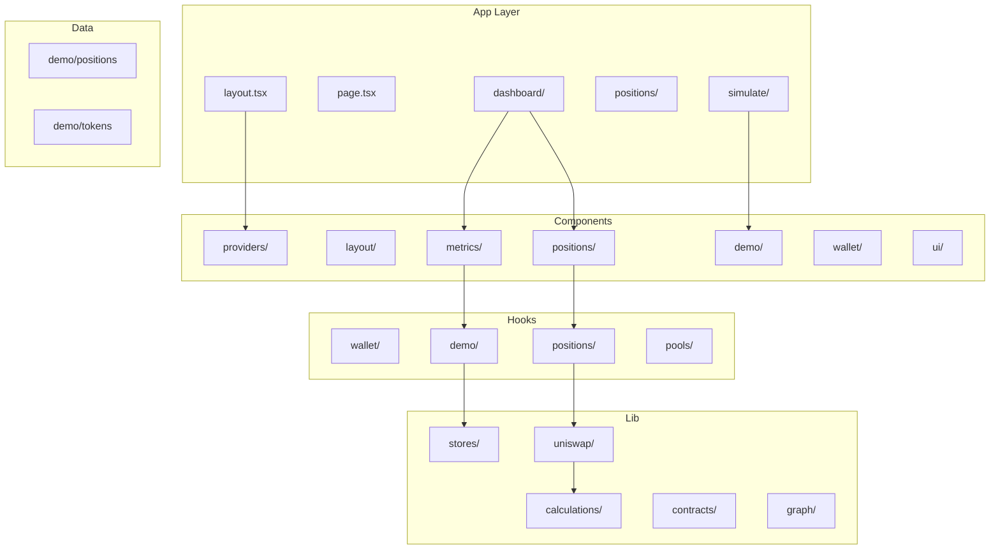
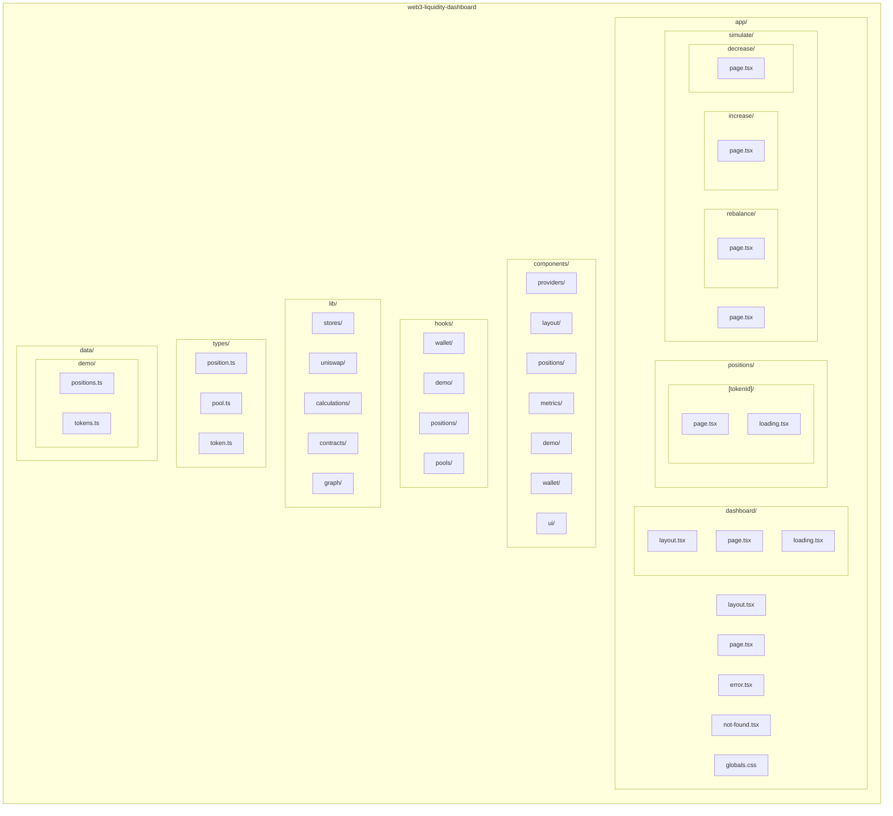

# Web3 Liquidity Dashboard


Dashboard profesional de gestión de liquidez para **Uniswap V3**, diseñado para LPs (Liquidity Providers) avanzados. Proporciona análisis detallado de posiciones, métricas en tiempo real y simulaciones de estrategias.

## Características Principales

- **Multi-Chain Support**: Ethereum Sepolia y Avalanche Fuji
- **Wallet Integration**: RainbowKit + Wagmi v2 con soporte para MetaMask, WalletConnect y Coinbase
- **Demo Mode**: Explora todas las funcionalidades sin conectar una wallet
- **Dashboard Completo**: TVL, fees acumuladas, estado de rangos
- **Detalle de Posiciones**: Visualización de rango de precios, exposición de tokens, Impermanent Loss
- **Simulaciones**: Rebalanceo, aumento y disminución de liquidez sin transacciones reales
- **Dark Mode First**: Diseño profesional estilo DeFi

---

## Stack Tecnológico

| Categoría | Tecnología |
|-----------|------------|
| Framework | Next.js 15.5.7+ (App Router) |
| Lenguaje | TypeScript (strict mode) |
| Styling | Tailwind CSS v4 |
| Web3 | Wagmi v2 + Viem + RainbowKit |
| State Management | Zustand (persist) |
| Data Fetching | TanStack Query v5 |
| Protocolos | Uniswap V3 SDK |
| Redes | Ethereum Sepolia, Avalanche Fuji |

---

## Flujo de la Aplicación



---

## Arquitectura del Proyecto



---

## Estructura de Carpetas



---

## Instalación

### Requisitos Previos

- Node.js 18.17+
- pnpm 8.0+

### Pasos

```bash
git clone <repository-url>
cd web3-liquidity-dashboard

pnpm install

pnpm dev
```

La aplicación estará disponible en `http://localhost:3000`

### Build de Producción

```bash
pnpm build
pnpm start
```

---

## Uso

### Demo Mode

El Demo Mode se activa automáticamente cuando no hay wallet conectada. También puedes activarlo manualmente desde el dashboard.

**Características del Demo Mode:**
- 5 posiciones de ejemplo con diferentes pools
- Datos realistas de TVL y fees
- Posiciones in-range y out-of-range
- Persistencia permanente del estado con Zustand

### Conectar Wallet

1. Click en "Connect Wallet" en el header
2. Selecciona tu wallet (MetaMask, WalletConnect, Coinbase)
3. Aprueba la conexión
4. Asegúrate de estar en una red soportada (Sepolia o Fuji)

### Dashboard

El dashboard muestra:
- **TVL Total**: Valor total de todas tus posiciones
- **Fees Acumuladas**: Fees pendientes de reclamar
- **Posiciones**: Número total de posiciones activas
- **Out of Range**: Alertas de posiciones fuera de rango

### Simulaciones

Las simulaciones te permiten probar estrategias sin realizar transacciones reales:

| Simulación | Descripción |
|------------|-------------|
| Rebalance | Ajustar el rango de precios de una posición |
| Add Liquidity | Agregar más tokens a una posición existente |
| Remove Liquidity | Retirar liquidez parcial o totalmente |

---

## Cálculos Uniswap V3

### Tick Math

```
price = 1.0001^tick
sqrtPriceX96 = sqrt(price) * 2^96
```

### Impermanent Loss

```
IL = 2 * sqrt(priceRatio) / (1 + priceRatio) - 1
```

### Position Health

Una posición está "in range" cuando:
```
tickLower <= currentTick < tickUpper
```

---

## Contratos Soportados

### Ethereum Sepolia

| Contrato | Dirección |
|----------|-----------|
| NonfungiblePositionManager | `0x1238536071E1c677A632429e3655c799b22cDA52` |
| Factory | `0x0227628f3F023bb0B980b67D528571c95c6DaC1c` |
| SwapRouter02 | `0x3bFA4769FB09eefC5a80d6E87c3B9C650f7Ae48E` |
| QuoterV2 | `0xEd1f6473345F45b75F8179591dd5bA1888cf2FB3` |

---

## State Management

El estado del Demo Mode se gestiona con **Zustand** y persiste automáticamente en localStorage:

```typescript
interface DemoState {
  isDemoMode: boolean
  enableDemoMode: () => void
  disableDemoMode: () => void
  toggleDemoMode: () => void
}
```

---

## Roadmap

- [ ] Soporte para Mainnet
- [ ] Histórico de transacciones
- [ ] Notificaciones de out-of-range
- [ ] Integración con más DEXs
- [ ] Gráficos de performance
- [ ] Export de datos a CSV

---

## Licencia

MIT License - Ver [LICENSE](LICENSE) para más detalles.

---

## Contribuir

1. Fork el repositorio
2. Crea una rama (`git checkout -b feature/nueva-feature`)
3. Commit tus cambios (`git commit -m 'Add nueva feature'`)
4. Push a la rama (`git push origin feature/nueva-feature`)
5. Abre un Pull Request
